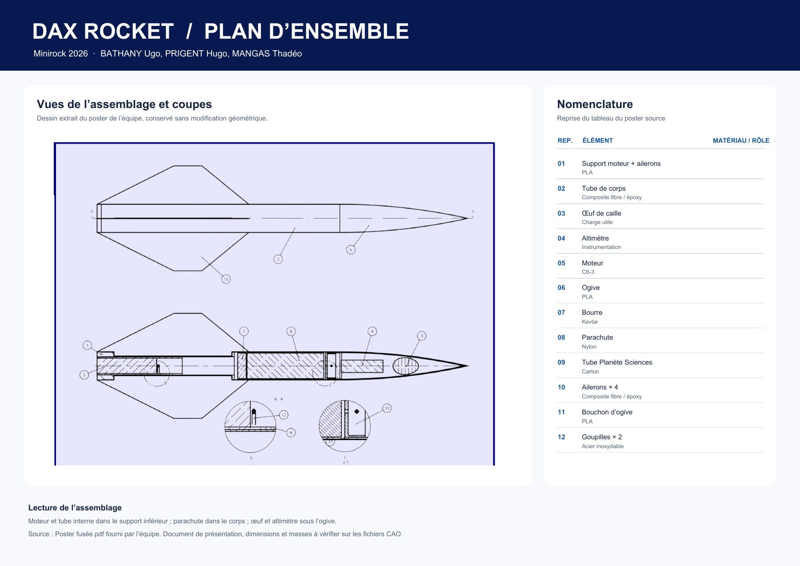
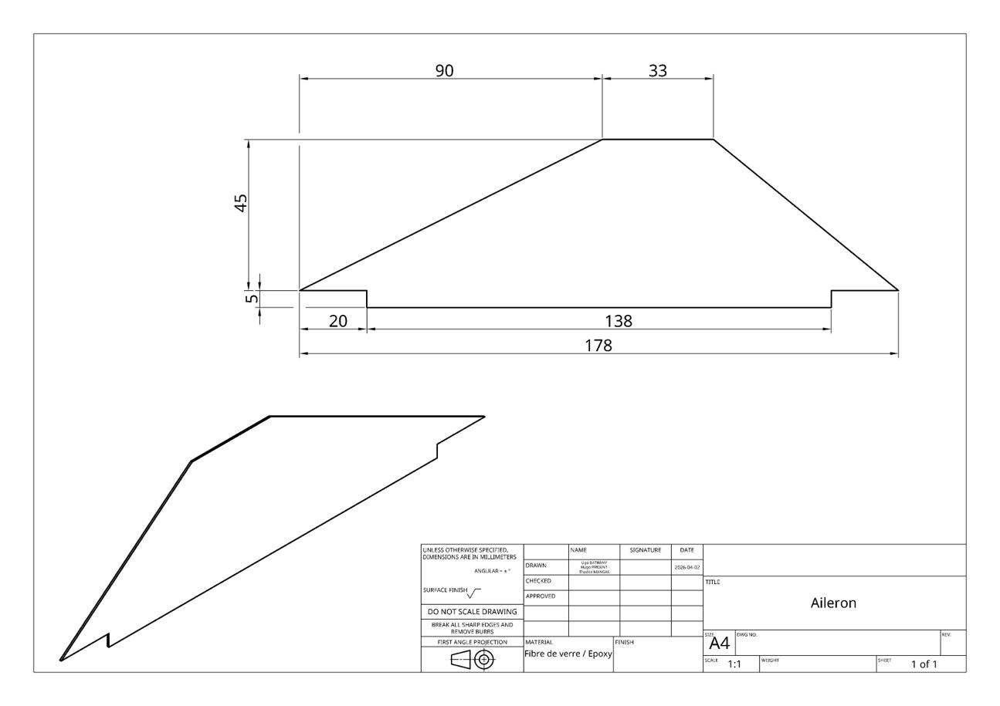
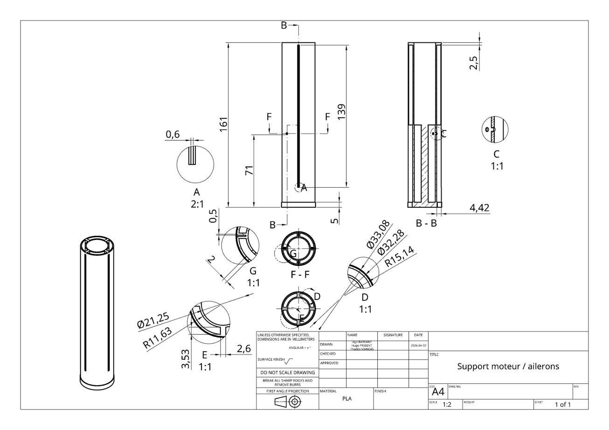
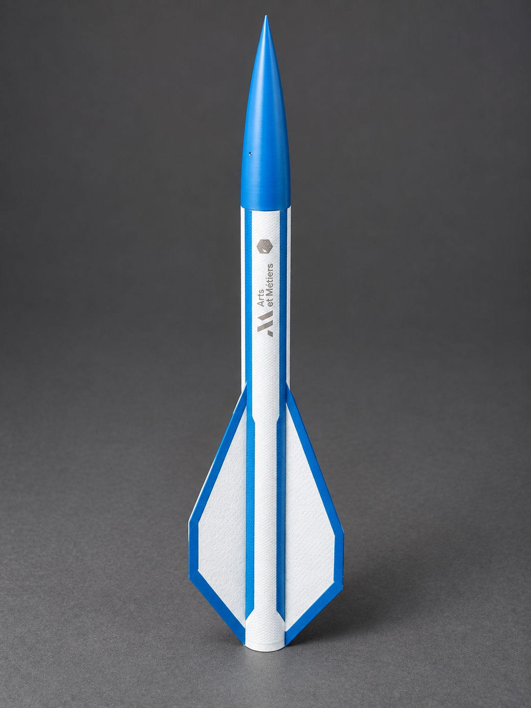
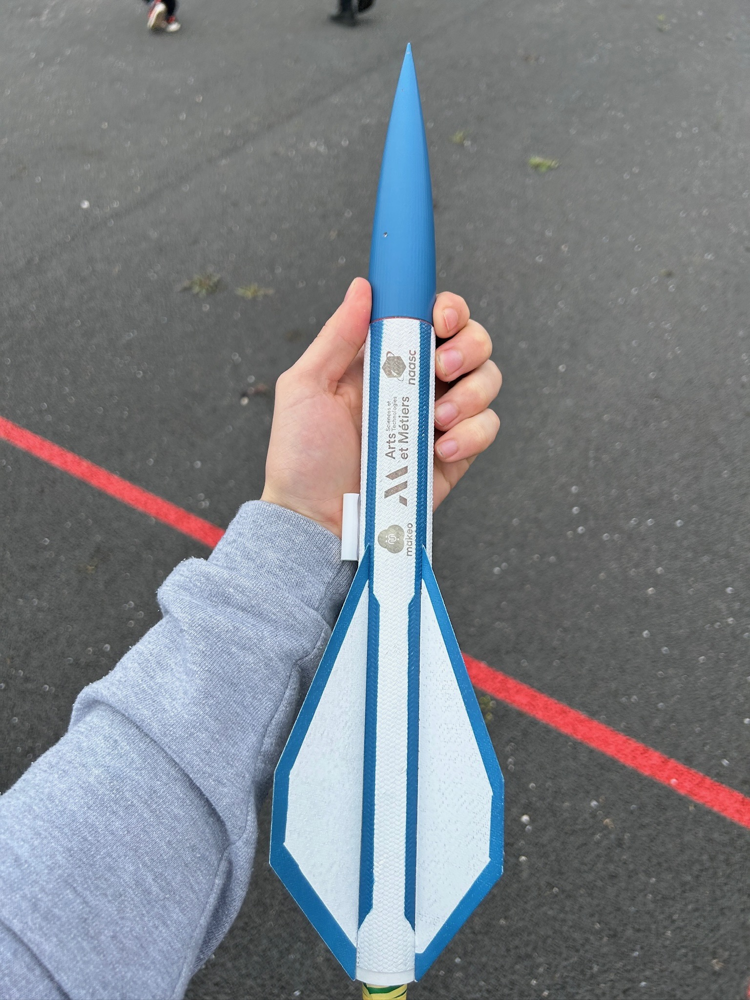

# DAX ROCKET — Minirock 2026

Projet réalisé par **Ugo BATHANY, Hugo PRIGENT et Thadéo MANGAS** pour le concours Minirock 2026.

DAX ROCKET est la microfusée conçue et réalisée pour Minirock 2026. Le dossier et le poster fixent une **altitude cible de 70 m**. Aucune altitude réellement atteinte n'est affirmée ici : aucune mesure de vol vérifiée n'a été fournie.

## Plans

Les dessins ci-dessous proviennent du poster de l'équipe. Cliquez sur chaque plan pour l'ouvrir en grand.

### Plan d'ensemble

[Ouvrir le plan d'ensemble en PDF](plans/plan_ensemble_DAX_ROCKET.pdf).

### Aileron

### Support moteur et ailerons

Les deux plans de pièces sont les images originales intégrées au poster. Le plan d'ensemble a été mis en page avec sa nomenclature. Vérifier les dimensions et masses sur les fichiers CAO avant fabrication.

## Prototype

  
  

À gauche : visuel de présentation assisté par IA à partir du prototype. À droite : photo du prototype réel.

## Projet

Le prototype associe un tube et des ailerons en composite fibre de verre / résine époxy, une ogive et un support moteur en PLA, un moteur C6-3, un parachute, un altimètre et un œuf de caille comme charge utile. La simulation OpenRocket sert à l'étude de stabilité et de trajectoire ; elle ne constitue pas une mesure du vol réel.

## Vidéo du vol

[Voir ou télécharger la vidéo originale du vol](media/vol_DAX_ROCKET.mp4).

Cette séquence montre le lancement puis la descente sous parachute. Le suivi a été réalisé dans DaVinci Resolve ; l'export est conservé à l'identique, avec son son d'origine.

## Ouvrir les simulations

- [`dax-fusee.ork`](openrocket/dax-fusee.ork) — modèle de conception, configuration C6-3.
- [`fusee-v1.ork`](openrocket/fusee-v1.ork) — version antérieure du modèle.

Ouvrir les fichiers `.ork` dans [OpenRocket](https://openrocket.info/). Les deux versions sont fournies pour documenter l'évolution de la conception. Les résultats calculés dépendent de la géométrie, des masses et des conditions configurées dans chaque fichier.
